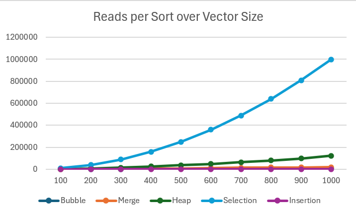

# Project 4 Report

Answer the following prompts directly in this file:
* Information about your dataset (you will be assigned a different grader for this project).
  * number represents the Pokemon's Pokedex number
  * name represents the name of the Pokemon
  * type1 represents the Pokemon's primary type
  * type2 represents the Pokemon's secondary type, if it has one
  * total represents the sum of all of the Pokemon's base stats
  * hp, attack, defense, sp_attack, sp_defense, and speed represent the respective base stats of the Pokemon
  * generation represents which set of games/which region the Pokemon first appeared in
  * legendary represents whether or not the Pokemon is a legendary Pokemon
  * Dataset collected by Nilesh Gupta (nileshely) on GitHub
    * https://github.com/nileshely/Pokemon/blob/main/Decoding%20Pokemon%20Analyzing%20the%20Dataset.ipynb
    * There were a couple of errors in the dataset, which I have corrected.
* Analyze the data. Graph the number of reads and allocations for each sorting algorithm and look at how the number of reads and allocations grows when the size of the data set grows. Compare and contrast the different sorting algorithms and draw conclusions about which sorting algorithms are more efficient. Discuss complexities and their effects.
   
  * Selection sort stands out as the highest in amount of reads - this aligns with its consistent O(N^2) time complexity. However, it also has a constant amount of space assignment. This makes it slow, but relatively memory-efficient.
  * Merge sort, meanwhile, stands out in being the only selected sort with a non-constant space complexity. It is relatively read-efficient, making it a solid stable option if memory isn't a concern.
  * Bubble, Insertion, and Heap are less exceptional. Heap has the highest reads per vector size of the three, but nowhere close to Selection. All three have constant allocation amounts.
* Look at the output from the stabilityTest function and answer the following questions:
  * How are the names sorted by default?
    * Initially, the names are sorted alphabetically by last name, then sorted alphabetically by first name within the last name groups.
  * How is the output from the two stable sorting algorithms different from the two unstable ones? Be specific in your answer, and use what you know about how each sorting algorithm works to justify your observations.
    * The stable algorithms (Bubble, Insertion, Merge) all maintain the order initially provided after sorting.
    * Meanwhile, the unstable algorithms (Selection, Heap) sort the list exclusively by last name, but lose the alphabetical order of first names.
    * This is because both sorts are based exclusively on comparisons with a specific other value, and do not care about the order of the surrounding values.
* Answers to the following questions: 
  * If you need to sort a contacts list on a mobile app, which sorting algorithm(s) would you use and why? 
    * In this scenario, I would want a stable sort with a high speed for a small list - stability so that users will not be thrown off by a change in relative order, and speed as most users will not have enough contacts for time complexity to rise significantly. Both Bubble and Insertion Sort meet these criteria.
  * What about if you need to sort a database of 20 million client files that are stored in a datacenter in the cloud?
    * In this case, we would want a sort that minimizes time complexity and memory usage. With such a large list, we want to sort through it as quickly as we can, and we cannot afford a non-constant space complexity. As such, Heap Sort would likely be the best tool for the job, provided we do not care about stability.

**Note: Any code that was not authored by yourself or the instructor must be cited in your report. This includes the use of concepts not taught in lecture.**